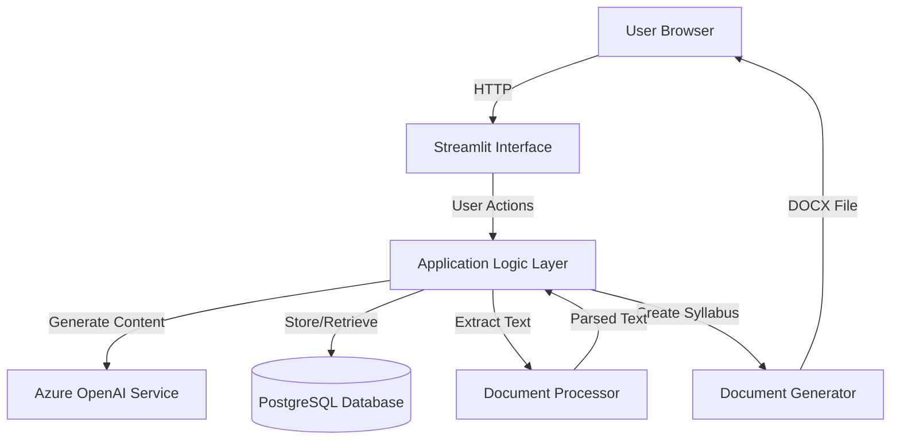

# Design Document: AI-Powered Syllabus Generation System

## Overview

The AI-Powered Syllabus Generation System is a web-based application that guides users through a multi-step workflow to create comprehensive course syllabi. The system leverages Microsoft Azure OpenAI (GPT-4o) to generate learning objectives at three levels: Terminal Learning Objectives (TLOs), Performance objectives, and Enabling Learning Objectives (ELOs). Built with Python and Streamlit, the application provides an intuitive interface for uploading organization profiles, selecting course types, and iteratively refining learning objectives until a complete syllabus document is generated.

The system follows a linear workflow where each step builds upon the previous one, ensuring that generated content is contextually relevant and aligned with the organization's educational goals. All user interactions and generated content are persisted in a PostgreSQL database, allowing for session recovery and historical tracking.

## Architecture

### High-Level Architecture



### Component Architecture

The system is organized into the following layers:

1. **Presentation Layer (Streamlit UI)**
   - Handles user interactions and displays workflow steps
   - Manages file uploads and downloads
   - Renders generated content and selection interfaces

2. **Application Logic Layer**
   - Orchestrates the multi-step workflow
   - Manages state transitions between workflow steps
   - Validates user inputs and selections

3. **AI Integration Layer**
   - Interfaces with Azure OpenAI API
   - Manages prompt engineering for each generation step
   - Handles API authentication and error recovery

4. **Data Access Layer**
   - Provides CRUD operations for all entities
   - Manages database connections and transactions
   - Ensures referential integrity

5. **Document Processing Layer**
   - Extracts text from uploaded documents (PDF, DOCX, TXT)
   - Generates final syllabus documents in DOCX format

## Components and Interfaces

### 1. Streamlit UI Component

**Responsibilities:**
- Render multi-step workflow interface
- Handle file uploads and downloads
- Display generated content with selection controls
- Show progress indicators and error messages

**Key Functions:**
```python
def render_upload_page() -> None:
    """Render organization profile upload interface"""

def render_summary_page(summary: OrganizationSummary) -> None:
    """Display organization profile summary"""

def render_course_type_selection() -> Optional[str]:
    """Display course type selection interface"""

def render_tlo_selection(tlos: List[TLO]) -> List[str]:
    """Display TLOs with selection checkboxes"""

def render_performance_selection(performances: List[Performance]) -> List[str]:
    """Display performances with selection checkboxes"""

def render_elo_selection(elos: List[ELO]) -> List[str]:
    """Display ELOs with selection checkboxes"""

def render_syllabus_generation() -> None:
    """Display syllabus generation interface with download button"""
```

### 2. Workflow Orchestrator

**Responsibilities:**
- Manage workflow state and step transitions
- Validate that prerequisites are met before advancing steps
- Coordinate between UI, AI service, and database

**Key Functions:**
```python
class WorkflowOrchestrator:
    def __init__(self, db: DatabaseService, ai: AIService):
        self.db = db
        self.ai = ai
        self.current_step = WorkflowStep.UPLOAD
    
    def process_organization_profile(self, file_content: bytes, file_type: str) -> OrganizationSummary:
        """Process uploaded organization profile and generate summary"""
    
    def generate_tlos(self, org_id: str, course_type: str) -> List[TLO]:
        """Generate TLOs based on organization context and course type"""
    
    def generate_performances(self, selected_tlo_ids: List[str]) -> List[Performance]:
        """Generate performance objectives from selected TLOs"""
    
    def generate_elos(self, selected_performance_ids: List[str]) -> List[ELO]:
        """Generate ELOs from selected performances"""
    
    def create_syllabus_document(self, session_id: str) -> bytes:
        """Compile all selections into final syllabus document"""
    
    def can_advance_to_step(self, target_step: WorkflowStep) -> bool:
        """Validate if user can advance to target workflow step"""
```

### 3. Azure OpenAI Service

**Responsibilities:**
- Manage connections to Azure OpenAI API
- Execute prompt-based content generation
- Handle API errors and retries

**Configuration:**
```python
class AzureOpenAIConfig:
    endpoint: str = "https://openaitcuc.openai.azure.com/"
    api_version: str = "2024-10-01-preview"
    deployment_name: str = "corpu-text-gpt-4o"
    embedding_deployment: str = "corpu-text-embedding-3-large"
    embedding_dimension: int = 1536
```

**Key Functions:**
```python
class AIService:
    def __init__(self, config: AzureOpenAIConfig):
        self.config = config
        self.client = self._initialize_client()
    
    def summarize_organization_profile(self, text: str) -> str:
        """Generate organization profile summary"""
    
    def generate_tlos(self, org_context: str, course_type: str, count: int = 5) -> List[str]:
        """Generate Terminal Learning Objectives"""
    
    def generate_performances(self, tlo_texts: List[str], count: int = 5) -> List[str]:
        """Generate performance objectives from TLOs"""
    
    def generate_elos(self, performance_texts: List[str], count: int = 3) -> List[str]:
        """Generate Enabling Learning Objectives from performances"""
    
    def format_syllabus_content(self, materials: SyllabusMaterials) -> str:
        """Format all selected materials into structured syllabus content"""
    
    def _call_api_with_retry(self, prompt: str, max_retries: int = 3) -> str:
        """Call Azure OpenAI API with exponential backoff retry"""
```

### 4. Document Processor

**Responsibilities:**
- Extract text from various document formats
- Handle encoding and formatting issues
- Validate document content

**Key Functions:**
```python
class DocumentProcessor:
    def extract_text_from_pdf(self, file_content: bytes) -> str:
        """Extract text from PDF file"""
    
    def extract_text_from_docx(self, file_content: bytes) -> str:
        """Extract text from DOCX file"""
    
    def extract_text_from_txt(self, file_content: bytes) -> str:
        """Extract text from TXT file"""
    
    def process_document(self, file_content: bytes, file_type: str) -> str:
        """Process document based on file type and return extracted text"""
    
    def validate_document_content(self, text: str) -> bool:
        """Validate that extracted text is not empty and is meaningful"""
```

### 5. Document Generator

**Responsibilities:**
- Create formatted DOCX syllabus documents
- Apply consistent styling and structure
- Include all selected learning objectives

**Key Functions:**
```python
class DocumentGenerator:
    def create_syllabus_document(self, materials: SyllabusMaterials) -> bytes:
        """Generate DOCX syllabus document from selected materials"""
    
    def _format_organization_section(self, doc: Document, org_summary: str) -> None:
        """Add organization profile section to document"""
    
    def _format_tlo_section(self, doc: Document, tlos: List[TLO]) -> None:
        """Add TLO section to document"""
    
    def _format_performance_section(self, doc: Document, performances: List[Performance]) -> None:
        """Add performance section to document"""
    
    def _format_elo_section(self, doc: Document, elos: List[ELO]) -> None:
        """Add ELO section to document"""
```

### 6. Database Service

**Responsibilities:**
- Provide data access layer for all entities
- Manage database connections and transactions
- Ensure data consistency and integrity

**Key Functions:**
```python
class DatabaseService:
    def __init__(self, connection_string: str):
        self.engine = create_engine(connection_string)
    
    def save_organization_profile(self, profile: OrganizationProfile) -> str:
        """Save organization profile and return ID"""
    
    def save_tlos(self, tlos: List[TLO], org_id: str, course_type: str) -> List[str]:
        """Save generated TLOs and return IDs"""
    
    def save_performances(self, performances: List[Performance], tlo_ids: List[str]) -> List[str]:
        """Save generated performances and return IDs"""
    
    def save_elos(self, elos: List[ELO], performance_ids: List[str]) -> List[str]:
        """Save generated ELOs and return IDs"""
    
    def save_syllabus(self, syllabus: Syllabus, session_id: str) -> str:
        """Save generated syllabus document and return ID"""
    
    def get_session_data(self, session_id: str) -> SessionData:
        """Retrieve all data for a user session"""
```

## Data Models

### Core Entities

```python
from dataclasses import dataclass
from datetime import datetime
from typing import List, Optional

@dataclass
class OrganizationProfile:
    id: Optional[str]
    original_text: str
    summary: str
    context_overview: str
    uploaded_at: datetime
    file_name: str
    file_type: str

@dataclass
class TLO:
    id: Optional[str]
    org_id: str
    course_type: str
    text: str
    generated_at: datetime
    is_selected: bool = False

@dataclass
class Performance:
    id: Optional[str]
    tlo_ids: List[str]
    text: str
    generated_at: datetime
    is_selected: bool = False

@dataclass
class ELO:
    id: Optional[str]
    performance_ids: List[str]
    text: str
    generated_at: datetime
    is_selected: bool = False

@dataclass
class Syllabus:
    id: Optional[str]
    session_id: str
    org_id: str
    course_type: str
    selected_tlo_ids: List[str]
    selected_performance_ids: List[str]
    selected_elo_ids: List[str]
    document_content: bytes
    created_at: datetime

@dataclass
class SessionData:
    session_id: str
    organization: Optional[OrganizationProfile]
    course_type: Optional[str]
    tlos: List[TLO]
    performances: List[Performance]
    elos: List[ELO]
    syllabus: Optional[Syllabus]
    current_step: str
```

### Database Schema

```sql
CREATE TABLE organization_profiles (
    id UUID PRIMARY KEY DEFAULT gen_random_uuid(),
    original_text TEXT NOT NULL,
    summary TEXT NOT NULL,
    context_overview TEXT NOT NULL,
    uploaded_at TIMESTAMP NOT NULL DEFAULT NOW(),
    file_name VARCHAR(255) NOT NULL,
    file_type VARCHAR(10) NOT NULL
);

CREATE TABLE tlos (
    id UUID PRIMARY KEY DEFAULT gen_random_uuid(),
    org_id UUID NOT NULL REFERENCES organization_profiles(id),
    course_type VARCHAR(100) NOT NULL,
    text TEXT NOT NULL,
    generated_at TIMESTAMP NOT NULL DEFAULT NOW(),
    is_selected BOOLEAN DEFAULT FALSE
);

CREATE TABLE performances (
    id UUID PRIMARY KEY DEFAULT gen_random_uuid(),
    text TEXT NOT NULL,
    generated_at TIMESTAMP NOT NULL DEFAULT NOW(),
    is_selected BOOLEAN DEFAULT FALSE
);

CREATE TABLE performance_tlo_mapping (
    performance_id UUID REFERENCES performances(id),
    tlo_id UUID REFERENCES tlos(id),
    PRIMARY KEY (performance_id, tlo_id)
);

CREATE TABLE elos (
    id UUID PRIMARY KEY DEFAULT gen_random_uuid(),
    text TEXT NOT NULL,
    generated_at TIMESTAMP NOT NULL DEFAULT NOW(),
    is_selected BOOLEAN DEFAULT FALSE
);

CREATE TABLE elo_performance_mapping (
    elo_id UUID REFERENCES elos(id),
    performance_id UUID REFERENCES performances(id),
    PRIMARY KEY (elo_id, performance_id)
);

CREATE TABLE syllabi (
    id UUID PRIMARY KEY DEFAULT gen_random_uuid(),
    session_id VARCHAR(255) NOT NULL,
    org_id UUID NOT NULL REFERENCES organization_profiles(id),
    course_type VARCHAR(100) NOT NULL,
    document_content BYTEA NOT NULL,
    created_at TIMESTAMP NOT NULL DEFAULT NOW()
);

CREATE TABLE syllabus_tlo_mapping (
    syllabus_id UUID REFERENCES syllabi(id),
    tlo_id UUID REFERENCES tlos(id),
    PRIMARY KEY (syllabus_id, tlo_id)
);

CREATE TABLE syllabus_performance_mapping (
    syllabus_id UUID REFERENCES syllabi(id),
    performance_id UUID REFERENCES performances(id),
    PRIMARY KEY (syllabus_id, performance_id)
);

CREATE TABLE syllabus_elo_mapping (
    syllabus_id UUID REFERENCES syllabi(id),
    elo_id UUID REFERENCES elos(id),
    PRIMARY KEY (syllabus_id, elo_id)
);

CREATE INDEX idx_tlos_org_id ON tlos(org_id);
CREATE INDEX idx_syllabi_session_id ON syllabi(session_id);
```


## Correctness Properties

*A property is a characteristic or behavior that should hold true across all valid executions of a system—essentially, a formal statement about what the system should do. Properties serve as the bridge between human-readable specifications and machine-verifiable correctness guarantees.*

### Property 1: File Format Validation

*For any* uploaded file, the system should accept it if and only if its format is one of the supported types (PDF, DOCX, TXT), and reject all other formats with an appropriate error message.

**Validates: Requirements 1.1, 14.1, 14.2, 14.3, 14.4**

### Property 2: Document Text Extraction

*For any* valid uploaded document in a supported format, the extracted text should be non-empty and contain meaningful content from the original document.

**Validates: Requirements 1.2, 14.5**

### Property 3: Data Persistence Round-Trip

*For any* entity (organization profile, TLO, performance, ELO, syllabus) that is saved to the database, retrieving it by its ID should return an equivalent entity with the same content.

**Validates: Requirements 1.5, 2.5, 3.3, 4.5, 5.4, 6.5, 7.4, 8.5, 9.4, 10.5, 12.1, 12.2, 12.3, 12.4**

### Property 4: UI Content Display

*For any* generated content (organization summary, TLOs, performances, ELOs), after generation is complete, the content should be visible in the Streamlit interface.

**Validates: Requirements 2.2, 2.3, 4.3, 5.3, 6.4, 7.3, 8.3, 9.3**

### Property 5: Indonesian Language Output

*For any* text generated by the system (summaries, UI labels, error messages), the text should be in Indonesian language, which can be verified by checking for Indonesian-specific characters and common Indonesian words.

**Validates: Requirements 2.4, 13.5**

### Property 6: Selection State Management

*For any* list of generated items (TLOs, performances, ELOs), when a user selects one or more items, the system state should reflect those selections and the is_selected flag should be set to true in the database.

**Validates: Requirements 5.1, 5.4, 7.1, 7.4, 9.1, 9.4**

### Property 7: Workflow Step Prerequisites

*For any* workflow step beyond the first, the step should be disabled (not accessible) until all prerequisites from previous steps are completed (e.g., at least one item selected).

**Validates: Requirements 5.5, 7.5, 9.5, 13.3**

### Property 8: Sequential Workflow Order

*For any* workflow execution, the steps should be accessible only in sequential order: Upload → Summary → Course Type → TLO → Performance → ELO → Syllabus, and users should not be able to skip steps.

**Validates: Requirements 13.2, 13.3**

### Property 9: Minimum Generation Count

*For any* generation step (TLOs, ELOs), the system should generate at least the minimum required number of options (3 for TLOs, 3 per performance for ELOs).

**Validates: Requirements 4.4, 8.4**

### Property 10: AI Service Context Propagation

*For any* AI generation step, the system should include the appropriate context from previous steps (organization profile for TLOs, selected TLOs for performances, selected performances for ELOs).

**Validates: Requirements 3.4, 4.2, 6.3, 8.2, 15.4**

### Property 11: Azure OpenAI Configuration

*For any* API call to Azure OpenAI, the system should use the correct endpoint (https://openaitcuc.openai.azure.com/), API version (2024-10-01-preview), and deployment names (corpu-text-gpt-4o for generation, corpu-text-embedding-3-large for embeddings).

**Validates: Requirements 11.1, 11.2, 11.3, 11.4**

### Property 12: Secure Credential Management

*For any* API authentication, the system should retrieve credentials from environment variables and should never contain hardcoded API keys in the source code.

**Validates: Requirements 11.5**

### Property 13: Syllabus Document Completeness

*For any* generated syllabus document, it should contain all required sections: organization profile summary, selected TLOs, selected performances, and selected ELOs.

**Validates: Requirements 10.1, 10.3**

### Property 14: Syllabus Document Format

*For any* generated syllabus document, the output should be a valid DOCX file that can be opened by standard document processors.

**Validates: Requirements 10.4**

### Property 15: Database Referential Integrity

*For any* related entities in the database (e.g., performances linked to TLOs, ELOs linked to performances), the foreign key relationships should be maintained, and deleting a parent entity should handle child entities appropriately.

**Validates: Requirements 12.5**

## Error Handling

### Document Upload Errors

**Error Scenarios:**
- Unsupported file format uploaded
- Empty or corrupted file uploaded
- File size exceeds limits
- File encoding issues

**Handling Strategy:**
```python
class DocumentUploadError(Exception):
    """Raised when document upload or processing fails"""
    pass

def handle_upload_error(error: Exception) -> str:
    """Return user-friendly Indonesian error message"""
    if isinstance(error, UnsupportedFormatError):
        return "Format file tidak didukung. Silakan unggah file PDF, DOCX, atau TXT."
    elif isinstance(error, EmptyFileError):
        return "File kosong atau tidak dapat dibaca. Silakan unggah file yang valid."
    elif isinstance(error, FileSizeError):
        return "Ukuran file terlalu besar. Maksimum 10MB."
    else:
        return "Terjadi kesalahan saat mengunggah file. Silakan coba lagi."
```

### Azure OpenAI API Errors

**Error Scenarios:**
- API connection timeout
- Rate limiting (429 errors)
- Authentication failures
- Invalid API responses

**Handling Strategy:**
```python
def call_api_with_retry(
    prompt: str,
    max_retries: int = 3,
    base_delay: float = 1.0
) -> str:
    """Call Azure OpenAI API with exponential backoff retry"""
    for attempt in range(max_retries):
        try:
            response = client.chat.completions.create(
                model=deployment_name,
                messages=[{"role": "user", "content": prompt}]
            )
            return response.choices[0].message.content
        except RateLimitError:
            if attempt < max_retries - 1:
                delay = base_delay * (2 ** attempt)
                time.sleep(delay)
            else:
                raise APIError("Layanan AI sedang sibuk. Silakan coba lagi nanti.")
        except AuthenticationError:
            raise APIError("Kesalahan autentikasi API. Silakan periksa konfigurasi.")
        except Timeout:
            if attempt < max_retries - 1:
                continue
            else:
                raise APIError("Koneksi timeout. Silakan periksa koneksi internet Anda.")
```

### Database Errors

**Error Scenarios:**
- Connection failures
- Constraint violations
- Transaction deadlocks
- Data integrity issues

**Handling Strategy:**
```python
def handle_database_error(error: Exception) -> str:
    """Return user-friendly Indonesian error message for database errors"""
    if isinstance(error, ConnectionError):
        return "Tidak dapat terhubung ke database. Silakan coba lagi."
    elif isinstance(error, IntegrityError):
        return "Terjadi kesalahan integritas data. Silakan hubungi administrator."
    else:
        return "Terjadi kesalahan database. Silakan coba lagi."
```

### Workflow State Errors

**Error Scenarios:**
- Attempting to access steps out of order
- Missing required selections
- Invalid state transitions

**Handling Strategy:**
```python
class WorkflowStateError(Exception):
    """Raised when workflow state is invalid"""
    pass

def validate_workflow_transition(
    current_step: WorkflowStep,
    target_step: WorkflowStep,
    session_data: SessionData
) -> None:
    """Validate that workflow transition is allowed"""
    if target_step.value > current_step.value + 1:
        raise WorkflowStateError(
            "Anda harus menyelesaikan langkah sebelumnya terlebih dahulu."
        )
    
    if target_step == WorkflowStep.TLO_GENERATION and not session_data.course_type:
        raise WorkflowStateError(
            "Silakan pilih jenis kursus terlebih dahulu."
        )
    
    if target_step == WorkflowStep.PERFORMANCE_GENERATION:
        if not any(tlo.is_selected for tlo in session_data.tlos):
            raise WorkflowStateError(
                "Silakan pilih setidaknya satu TLO terlebih dahulu."
            )
```

## Testing Strategy

### Dual Testing Approach

The testing strategy employs both unit tests and property-based tests to ensure comprehensive coverage:

- **Unit tests**: Verify specific examples, edge cases, and error conditions
- **Property tests**: Verify universal properties across all inputs

Both approaches are complementary and necessary. Unit tests catch concrete bugs in specific scenarios, while property tests verify general correctness across a wide range of inputs.

### Property-Based Testing Configuration

**Library Selection:** We will use **Hypothesis** for Python, which is the standard property-based testing library for Python applications.

**Configuration:**
- Minimum 100 iterations per property test (due to randomization)
- Each property test must reference its design document property
- Tag format: **Feature: ai-syllabus-generator, Property {number}: {property_text}**

**Example Property Test:**
```python
from hypothesis import given, strategies as st
import pytest

# Feature: ai-syllabus-generator, Property 1: File Format Validation
@given(
    file_extension=st.sampled_from(['.pdf', '.docx', '.txt', '.jpg', '.png', '.exe'])
)
@pytest.mark.property_test
def test_file_format_validation(file_extension):
    """Property 1: File format validation"""
    supported_formats = {'.pdf', '.docx', '.txt'}
    
    is_accepted = document_processor.is_format_supported(file_extension)
    
    if file_extension in supported_formats:
        assert is_accepted, f"Should accept {file_extension}"
    else:
        assert not is_accepted, f"Should reject {file_extension}"
```

### Unit Testing Strategy

**Focus Areas:**
1. **Document Processing**: Test specific document formats with known content
2. **AI Service Integration**: Mock API calls and test response handling
3. **Database Operations**: Test CRUD operations with specific test data
4. **Workflow State Management**: Test state transitions with specific scenarios
5. **Error Handling**: Test specific error conditions and recovery

**Example Unit Test:**
```python
def test_pdf_text_extraction():
    """Test that PDF text extraction works for a known document"""
    # Arrange
    test_pdf_path = "tests/fixtures/sample_org_profile.pdf"
    expected_text = "Sample Organization Profile"
    
    # Act
    with open(test_pdf_path, 'rb') as f:
        extracted_text = document_processor.extract_text_from_pdf(f.read())
    
    # Assert
    assert expected_text in extracted_text
    assert len(extracted_text) > 100  # Meaningful content
```

### Integration Testing

**Scope:**
- End-to-end workflow testing from upload to syllabus generation
- Database integration with actual PostgreSQL instance
- Azure OpenAI API integration (with test account)
- Streamlit UI rendering and interaction

**Example Integration Test:**
```python
@pytest.mark.integration
def test_complete_syllabus_generation_workflow(test_db, mock_ai_service):
    """Test complete workflow from upload to syllabus generation"""
    # Arrange
    orchestrator = WorkflowOrchestrator(test_db, mock_ai_service)
    test_file = load_test_document("sample_org_profile.pdf")
    
    # Act - Upload and process
    org_summary = orchestrator.process_organization_profile(
        test_file, "pdf"
    )
    assert org_summary.summary is not None
    
    # Act - Generate TLOs
    tlos = orchestrator.generate_tlos(org_summary.id, "B2B")
    assert len(tlos) >= 3
    
    # Act - Select TLOs and generate performances
    selected_tlo_ids = [tlos[0].id, tlos[1].id]
    performances = orchestrator.generate_performances(selected_tlo_ids)
    assert len(performances) > 0
    
    # Act - Select performances and generate ELOs
    selected_perf_ids = [performances[0].id]
    elos = orchestrator.generate_elos(selected_perf_ids)
    assert len(elos) >= 3
    
    # Act - Generate syllabus
    session_id = "test-session-123"
    syllabus_doc = orchestrator.create_syllabus_document(session_id)
    
    # Assert
    assert len(syllabus_doc) > 0
    assert is_valid_docx(syllabus_doc)
```

### Test Coverage Goals

- **Unit Test Coverage**: Minimum 80% code coverage
- **Property Test Coverage**: All 15 correctness properties implemented
- **Integration Test Coverage**: All major workflow paths tested
- **Error Handling Coverage**: All error scenarios tested

### Continuous Testing

- Run unit tests on every commit
- Run property tests (with reduced iterations) on every commit
- Run full property tests (100+ iterations) nightly
- Run integration tests before deployment
- Monitor test execution time and optimize slow tests
