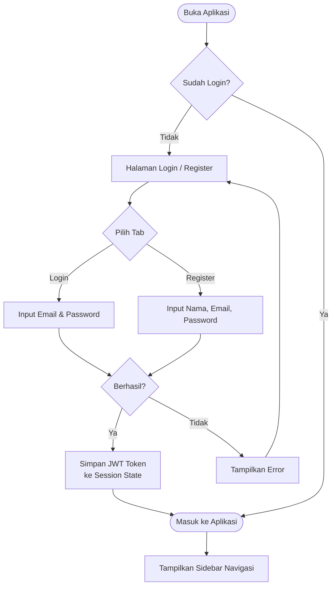
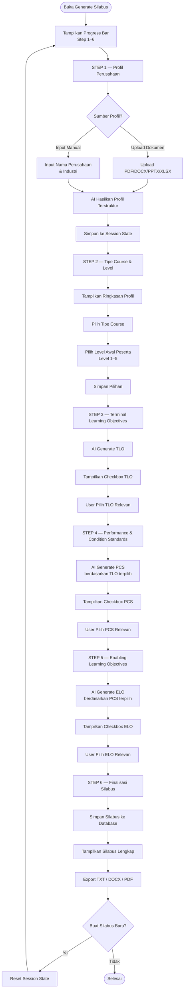
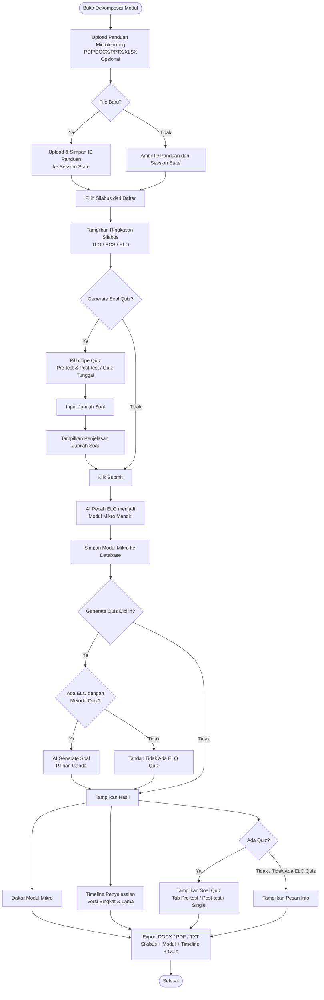
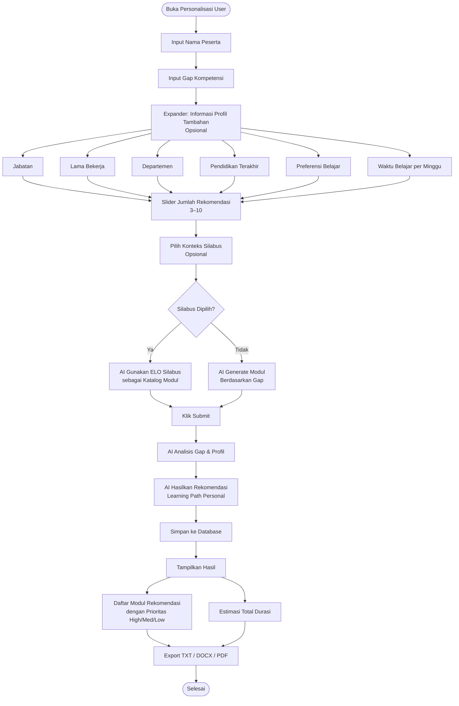
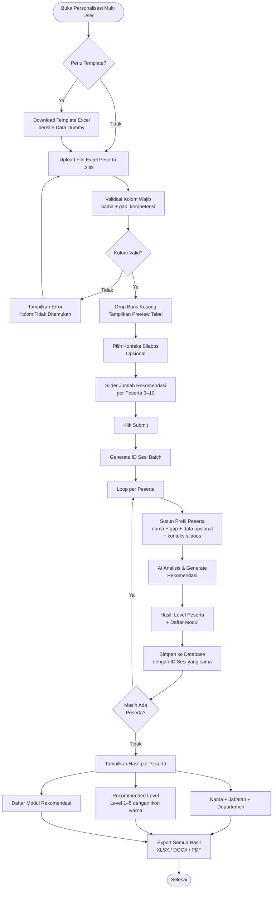
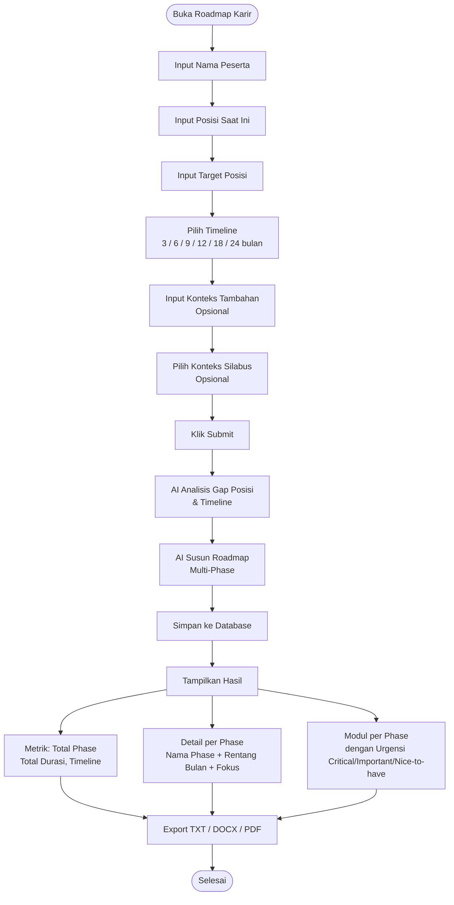
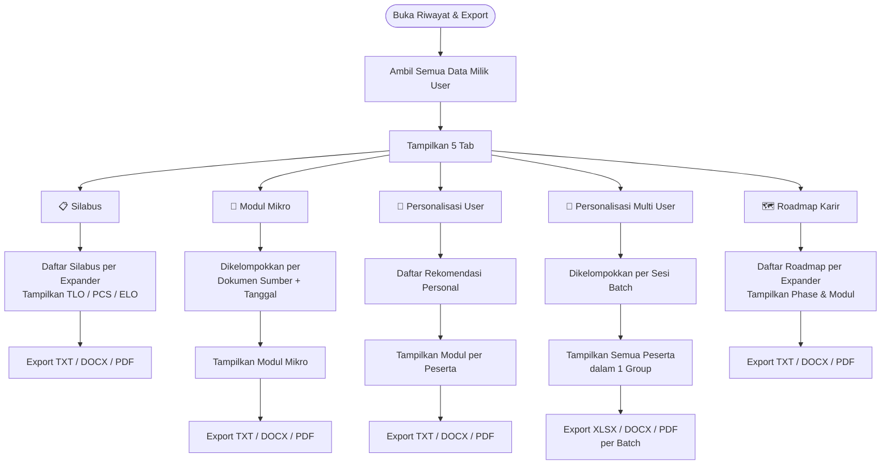
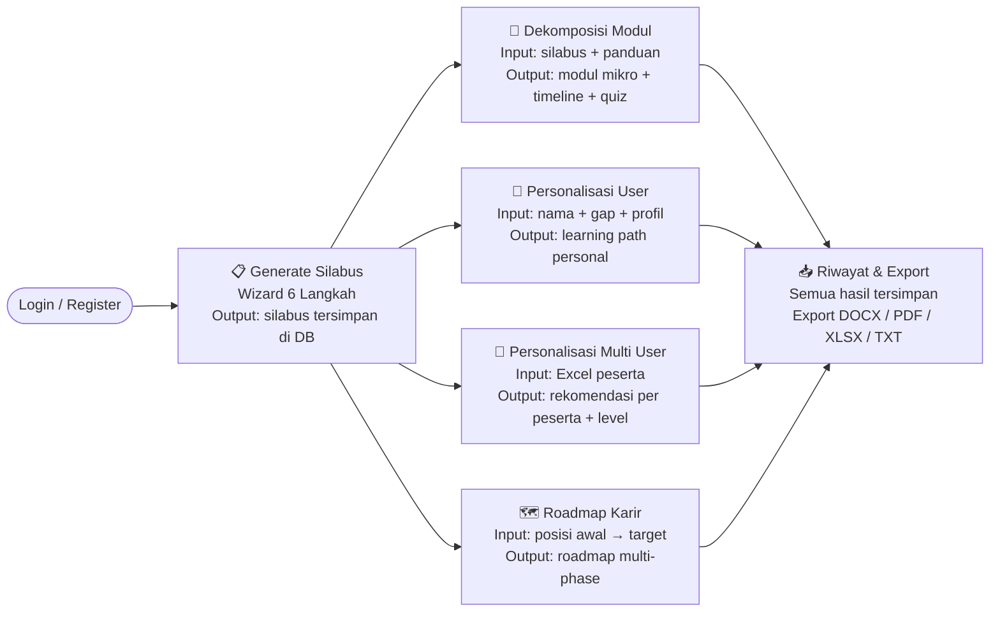

# Flowchart Alur Aplikasi PRIMA
# TelkomAthon 2025 — Tim LDD SoDSNP

> Render menggunakan Mermaid. Buka di VS Code (extension: Markdown Preview Mermaid Support), GitHub, atau paste ke https://mermaid.live

---

## 0. Alur Autentikasi

---

## 1. Generate Silabus (Wizard 6 Langkah)

---

## 2. Dekomposisi Modul Mikro

---

## 3. Personalisasi User (Individual)

---

## 4. Personalisasi Multi User (Bulk)

---

## 5. Roadmap Karir

---

## 6. Riwayat & Export

---

## 7. Alur End-to-End (Overview)

